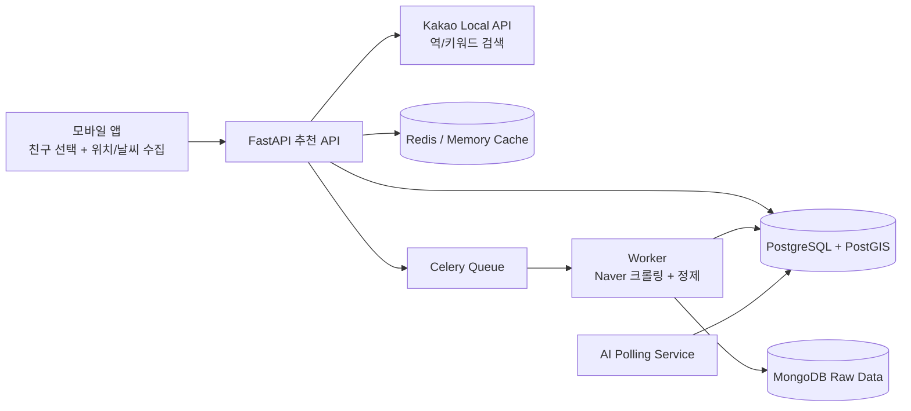

# 🎉 오늘 뭐할까? (What Are We Doing Today?)

친구들의 **실시간 위치 + 현재 날씨 + 장소 데이터**를 조합해,  
모두가 만나기 좋은 **중간 지점 놀거리**를 추천하는 모바일 앱입니다.

> 📢 **발표 한 줄 요약**  
> “친구들과 만날 때, *어디서* + *뭘 할지*를 한 번에 해결해주는 중간지점 추천 앱”

---

## 1) 🎯 기획 의도

### ❗ 문제 정의
- 약속 잡을 때 항상 생기는 문제: **“어디서 만날지”**, **“뭘 할지”**를 동시에 정하기 어렵다.
- 단순 거리 기준 추천은 실제 체감(날씨, 장소 품질, 이동 공평성)을 반영하지 못한다.

### 💡 해결 방향
- 사용자와 친구들의 위치를 바탕으로 **중간 지점**을 계산한다.
- 해당 지점 주변에서 활동성 키워드 기반으로 장소를 수집하고,
- **거리/공평성 + 날씨 적합도 + 네이버 평점 신뢰도**를 합산해 우선순위를 정한다.

### 🏁 서비스 목표
- 약속 결정 시간을 줄이고,
- “누구에게도 과도하게 멀지 않은” 공정한 추천 경험을 제공한다.

---

## 2) 🧭 서비스 한눈에 보기



---

## 3) 🛠 기술 스택

| 영역 | 기술 |
|---|---|
| 📱 Mobile | React Native, Expo, Expo Router, Zustand, AsyncStorage, WebView, BottomSheet |
| ⚙️ Backend | FastAPI, SQLModel, SQLAlchemy Async, GeoAlchemy2, HTTPX, Celery |
| 🗄 Data | PostgreSQL(PostGIS), Redis, MongoDB |
| 🤖 Worker | Celery Worker, Playwright(Chromium), Requests, PyMongo, Psycopg2 |
| 🧠 AI Service | FastAPI + Async Polling, PyTorch/Transformers 기반 확장 구조 |
| 🧱 Infra | Docker Compose, ngrok(모바일 실기기 연동), EAS Build |

---

## 4) 🚀 핵심 기능과 구현 과정

### 4-1. 👥 친구 기반 중간 지점 추천
1. 모바일에서 친구를 선택하고(최소 2인), 현재 위치/날씨를 함께 전송  
   (`mobile/components/FriendSelector.tsx`)
2. 백엔드가 참여자 평균 좌표를 계산하고, 주변 역/키워드 장소를 Kakao API로 수집  
   (`backend/app/services/recommendation_service.py`)
3. 중복 제거 + 부적합 장소 필터링 후 후보군 생성
4. 캐시(Redis 또는 in-memory)로 동일 요청 재사용
5. 최종 점수로 정렬해 추천 결과 반환

### 4-2. 📊 랭킹 로직(날씨 가중치 반영)
- 기본 날씨:  
  `0.30*거리 + 0.05*평점 + 0.20*날씨 + 0.45*리뷰수 신뢰도`
- 비/눈 날씨:  
  `0.25*거리 + 0.05*평점 + 0.25*날씨 + 0.45*리뷰수 신뢰도`
- 거리 계산은 하버사인 + 이동거리 분산(공평성)까지 반영
- 평점은 단순 평균이 아닌 **베이지안 보정**으로 과소표본 왜곡 완화
- 네이버 평점 `0.0` 장소는 비-0 평점 후보가 있을 때 결과에서 제외

### 4-3. 🔄 비동기 Stage2 데이터 수집 파이프라인
- 추천 응답은 빠르게 반환하고, 상세 데이터(리뷰/사진)는 백그라운드 수집
- `IngestionJob` 생성 → Celery enqueue → Worker 처리
- Worker는
  - Kakao->Naver 매핑(이름/좌표/주소 신뢰도),
  - Naver 리뷰/사진 크롤링(무한루프 방지 가드),
  - 원본(Mongo) + 요약 피처(PostgreSQL) 저장을 수행
- UI에서는 `photo_collection_status(PENDING/READY/EMPTY/FAILED)`로 상태를 명확히 표현

### 4-4. 🧑‍🤝‍🧑 사용자/친구 기능
- 카카오 로그인(WebView OAuth) 및 사용자 DB 동기화
- 상태메시지 설정(24시간 만료), 현재 위치 동기화
- 초대 링크 생성/수락(딥링크: `myapp://invite?token=...`)
- 친구 목록/삭제/선택 기반 추천 연동

### 4-5. 🌦️ 날씨 연동 UI
- 위치 권한 기반으로 기상청 초단기 API 조회
- 날씨 상태(맑음/흐림/비/눈)에 따라 홈 상단 카드 배경/문구/추천 맥락 동적 변경

---

## 5) 🎨 UI 구성

### 🗺️ 화면 흐름
`온보딩 → 로그인 → 홈(날씨/친구선택/추천) → 상세 → 관심목록/나의지도/마이페이지`

### 📱 주요 화면
| 화면 | 핵심 UI/UX 포인트 |
|---|---|
| 🌱 온보딩 | 3단 슬라이드로 서비스 가치(트렌드/중간지점/추천)를 빠르게 전달 |
| 🏠 홈 | 날씨 카드 + 친구 선택 모달 + 카테고리 필터 + 추천 카드 리스트 |
| 📍 활동 상세 | 사진 갤러리, 태그/거리/출처역, 링크 이동, 수집 실패 사유 노출 |
| 🗺️ 나의 지도 | KakaoMap 마커 + BottomSheet 상세 카드 |
| 👤 마이페이지 | 상태메시지 편집, 위치 동기화, 친구 초대/삭제, 설정 메뉴 |

### 🖼️ 온보딩 이미지
| 1 | 2 | 3 |
|---|---|---|
|  |  |  |

---

## 6) 🗂 프로젝트 구조

```text
.
├── mobile/      # Expo React Native 앱
├── backend/     # FastAPI API 서버
├── worker/      # Celery + Playwright 크롤링 워커
├── ai/          # AI Polling 서비스(비동기 작업 처리 구조)
├── docker-compose.yml
└── README.md
```

---

## 7) ⚙️ 실행 방법

### 0. 📦 준비
- Docker / Docker Compose
- Node.js 18+
- Expo Go(실기기 테스트 시)

### 1. 🧱 백엔드 + 인프라 실행
```bash
docker-compose up --build
```

- Backend: `http://localhost:8000/docs`
- PostgreSQL: `localhost:5440`
- Redis: `localhost:6381`
- MongoDB: `localhost:27018`

### 2. 📱 모바일 실행
```bash
cd mobile
npm install
npm run start:lan
```

`start:lan`은 현재 LAN IP를 찾아 `EXPO_PUBLIC_BACKEND_URL`을 자동 구성합니다.

### 3. 🔑 필수/권장 환경변수

#### ⚙️ Backend
- `KAKAO_REST_API_KEY` (필수, 추천 API용)
- `MIDPOINT_ENABLE_INGESTION_ENQUEUE` (기본 true)
- `MIDPOINT_CACHE_TTL_SECONDS` (기본 900)
- `INVITE_BASE_URL` (기본 `myapp://invite`)
- `INVITE_TOKEN_TTL_DAYS` (기본 7)

#### 📱 Mobile
- `EXPO_PUBLIC_BACKEND_URL`
- `EXPO_PUBLIC_KAKAO_MAP_JS_KEY`
- `EXPO_PUBLIC_KMA_BASE_URL`
- `EXPO_PUBLIC_KMA_SERVICE_KEY_ENCODED`

---

## 8) 🔌 주요 API

| Method | Endpoint | 설명 |
|---|---|---|
| `POST` | `/api/v1/auth/kakao` | 카카오 로그인/회원 동기화 |
| `GET` | `/api/v1/friends` | 친구 목록 조회 |
| `POST` | `/api/v1/friends/invite` | 초대 링크 생성 |
| `POST` | `/api/v1/friends/invite/accept` | 초대 수락 |
| `POST` | `/api/v1/users/location` | 사용자 현재 위치 업데이트 |
| `POST` | `/api/v1/users/status-message` | 상태메시지 업데이트 |
| `POST` | `/api/v1/recommend/midpoint-hotplaces` | 중간지점 기반 핫플 추천 |
| `POST` | `/api/v1/internal/ingestion/jobs` | 내부 수집 Job 생성 |
| `GET` | `/api/v1/internal/ingestion/jobs/{job_id}` | 수집 Job 상태 조회 |

---

## 9) ✅ 테스트

```bash
# backend
cd backend
python -m unittest tests/test_recommendation_service.py tests/test_ingestion_service.py

# worker
cd ../worker
python -m unittest tests/test_naver_place_crawler.py
```

---

## 10) 🔮 현재 범위와 다음 단계

- 현재 Instagram 트렌드 지표는 **deterministic placeholder**로 동작
- 향후 계획
  1. 실제 트렌드 수집 소스 연동
  2. 추천 설명(why this place) 강화
  3. 추천 결과 A/B 실험 및 개인화 모델 고도화
